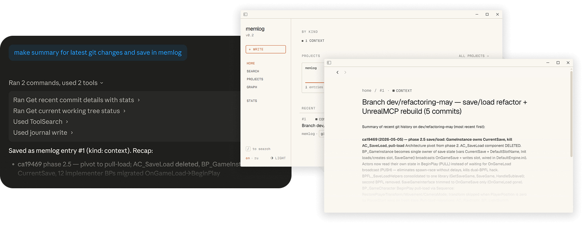

<div align="center">

# memlog

**A local, lightweight structured memory layer for LLM.**

MCP for Claude Code, ChatGPT Codex and etc.
UI for you.


</div>

## Why memlog

A bare LLM forgets everything between sessions. You end up re-pasting the same context, re-deciding settled questions, and watching the model propose approaches you rejected last week. memlog gives the model a small, structured place to write things down — and pull them back later — without ceremony.

- **No embeddings**, no vector search, no GPU, no Python. Just a SQLite file with FTS5, plus a tiny Pyodide-bundled morphology pass.

## How to use

1. Install the desktop app (bundled with the MCP server binary).
2. Register the MCP server in your client (Claude, ChatGPT Codex, etc.) — point it to the bundled binary.
3. Start chatting. Ask to "save to memlog" or "check memlog" or something like that when it's relevant.
4. The model will write important info to the journal, and pull it back when relevant.
5. Open the desktop app to read, search, redact, and manage the journal entries manually to see what the model remembers.

<p align="center">
  
</p>

## Install

### 1. Get the desktop app

Release contains both the MCP server binary and the desktop viewer app.

Download for your OS from [**Releases**](https://github.com/sorption-dev/memlog/releases/latest).

### 2. Wire it up to your LLM client

> An in-app "Connect to Claude/Codex" button is on the roadmap. Until then, register the MCP by hand — pick your client below.

#### 2a. Find the bundled binary

The sidecar `memlog` binary lives next to the main desktop app binary:

| OS          | Path                                                                                       |
| ----------- | ------------------------------------------------------------------------------------------ |
| macOS       | `/Applications/memlog.app/Contents/MacOS/memlog`                                           |
| Windows     | `%LOCALAPPDATA%\memlog\memlog.exe` (i.e. `C:\Users\<you>\AppData\Local\memlog\memlog.exe`) |
| Linux (deb) | `/usr/bin/memlog`                                                                          |

Use this absolute path in every client config below.

#### 2b. Claude Code (CLI)

Easiest — let the CLI write the config for you:

```bash
claude mcp add memlog -- <bundled-binary-path> --mcp
```

Or edit `~/.claude.json` directly under `mcpServers` (or `<repo>/.mcp.json` for per-project scope).

#### 2c. Claude Desktop

Edit (creating if missing) `claude_desktop_config.json`:

| OS / installer                              | Path                                                                                                                    |
| ------------------------------------------- | ----------------------------------------------------------------------------------------------------------------------- |
| macOS                                       | `~/Library/Application Support/Claude/claude_desktop_config.json`                                                       |
| Windows (standard installer from claude.ai) | `%APPDATA%\Claude\claude_desktop_config.json` (i.e. `C:\Users\<you>\AppData\Roaming\Claude\claude_desktop_config.json`) |
| Windows (MSIX / Microsoft Store)            | `%LOCALAPPDATA%\Packages\Claude_pzs8sxrjxfjjc\LocalCache\Roaming\Claude\claude_desktop_config.json`                     |

**Common Example:**

```json
{
  "mcpServers": {
    "memlog": {
      "command": "<bundled-binary-path>",
      "args": ["--mcp"]
    }
  }
}
```

**For Windows:**

```json
{
  "mcpServers": {
    "memlog": {
      "command": "cmd",
      "args": [
        "/c",
       "cd /d \"%LOCALAPPDATA%\\memlog\" && memlog.exe --mcp"
      ]
    }
  }
}
```

#### 2d. ChatGPT Codex (CLI)

Edit `~/.codex/config.toml` (it's TOML, not JSON):

```toml
[mcp_servers.memlog]
command = "<bundled-binary-path>"
args = ["--mcp"]
```

#### 2e. Restart and verify

Restart the client. The model now sees 8 `journal_*` tools. To sanity-check, ask it: _"Call `journal_context` and tell me the project info."_

---

## vs. MemPalace

[MemPalace](https://github.com/MemPalace/mempalace) is the popular alternative. It does a lot more — and that's the problem if you just want your agent to remember things.

|                       | MemPalace                                              | **memlog**                                           |
| --------------------- | ------------------------------------------------------ | ---------------------------------------------------- |
| Search                | Semantic (vector embeddings)                           | SQLite FTS5                                          |
| Embedding model       | Required, runs locally                                 | None                                                 |
| GPU / CUDA            | Effectively required for decent speed                  | Not used                                             |
| Windows support       | Local LLM stack often broken on Windows even with CUDA | Just a single binary, runs anywhere                  |
| Disk footprint        | GBs (models + embeddings)                              | ~50 MB (binary + Pyodide for morphology)             |
| Russian / non-English | English-tuned, no morphology                           | Russian morphology built in (pymorphy3, offline)     |
| What's stored         | Verbatim conversation chunks                           | Compact typed entries the model writes intentionally |
| Tool surface          | 29 MCP tools (wings / rooms / drawers / diaries / …)   | 8 MCP tools                                          |
| Setup                 | Python env + model downloads                           | Download release, point Claude at the binary         |

memlog is deliberately the boring choice: no embeddings, no models, no GPU, no Python. Just a SQLite file with FTS5, plus a tiny Pyodide-bundled morphology pass for Russian.

---

## Features

- **Six entry kinds** — `decision`, `fact`, `preference`, `todo`, `context`, `question`
- **Link graph** — `supersedes`, `depends_on`, `contradicts`, `refines`, `answers`
- **FTS5 search** with proper ranking
- **Russian morphology** — `решение` matches `решения`, `решений`, ... (pymorphy3 in Pyodide, fully offline)
- **Per-project sessions** — `session_id` auto-derived from `git rev-parse --show-toplevel`
- **Project groups** — query across related repos
- **Local-first** — single SQLite file, no cloud, no telemetry, no account
- **Desktop viewer** — Tauri app for humans to read, search, group, redact

## How it works

The model gets 8 MCP tools:

| Tool              | What it does                                       |
| ----------------- | -------------------------------------------------- |
| `journal_write`   | Log a typed entry                                  |
| `journal_search`  | FTS query, filter by kind / session / group / time |
| `journal_recent`  | Recent entries for current project                 |
| `journal_get`     | Fetch one entry, optionally with link neighbors    |
| `journal_link`    | Connect two entries via a relation                 |
| `journal_redact`  | Tombstone an entry, keep its links                 |
| `journal_context` | Project info, available groups, morph status       |
| `journal_stats`   | Activity by kind / day / hour                      |

`session_id` is auto-derived from the git root, so the model just calls `journal_write` and the entry lands in the right project's bucket.

## Database

By default the database lives next to the binary at `<install_dir>/data/db.sqlite` — both the desktop app and the MCP server look there, so they share one DB without any extra setup.

Want it elsewhere (custom drive, synced folder, an existing DB on macOS, etc.)? Drop a `config.json` next to the binary:

```json
{ "db_path": "/absolute/path/to/your/db.sqlite" }
```

Both the app and the MCP read it. Resolution order: `MEMLOG_DB` env var → `--db` flag → `config.json` `db_path` → built-in default.

## Run modes

```bash
memlog            # stdio JSON-RPC (used by the desktop viewer)
memlog --mcp      # MCP stdio server (Claude clients)
memlog --http     # HTTP API (handy for curl / debugging)
memlog --help
```

Flags: `--db <path>` (env `MEMLOG_DB`), `--port <n>` (env `MEMLOG_PORT`, `--http` only), `--host <addr>`.

## Build from source

For contributors. End users should grab the release above.

Requires [Bun](https://bun.sh/) ≥ 1.3 and (for the desktop app) the [Rust toolchain](https://rustup.rs/).

```bash
git clone https://github.com/<your-user>/memlog.git
cd memlog

# MCP server binary
cd mcp && bun install && bun run compile     # → dist/memlog

# Desktop app
cd ../viewer && bun install
bun run tauri:dev                             # dev
bun run tauri:build                           # production bundle
```

---

## Status

Pre-1.0. Schema may evolve. Single-user / single-machine is the supported path.

## License

**memlog** is source-available under the [memlog Personal Use License 1.0](LICENSE) — free for personal, non-commercial use on your own devices, including modifications for personal use.
