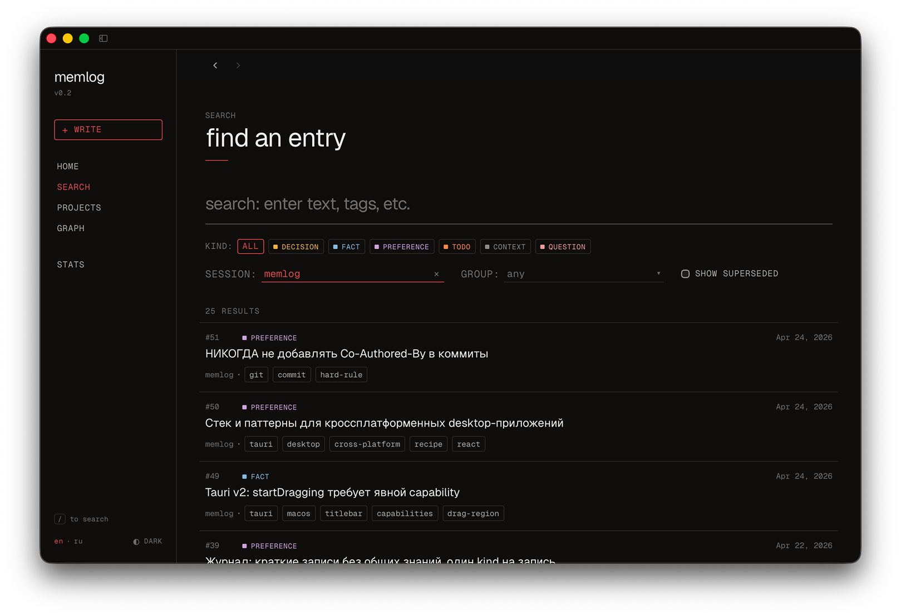

<div align="center">

# memlog

**A local, lightweight structured memory layer for LLM.**

MCP for Claude Code, ChatGPT Codex and etc.
UI fro you.



</div>

## Install

### 1. Get the desktop app

Download for your OS from [**Releases**](https://github.com/<your-user>/memlog/releases/latest):

Open it once. The app bundles the MCP server binary and creates the database at `~/.memlog/memlog.db`.

### 2. Wire it up to your LLM client

Find the bundled binary path:

| OS | Path |
|---|---|
| macOS | `/Applications/memlog.app/Contents/Resources/binaries/memlog` |
| Windows | `C:\Program Files\memlog\binaries\memlog.exe` |
| Linux | `/usr/lib/memlog/binaries/memlog` (deb) or inside the AppImage |

**Claude Code:**

```bash
claude mcp add memlog -- <bundled-binary-path> --mcp
```

**Claude Desktop** — edit `claude_desktop_config.json`:

```json
{
  "mcpServers": {
    "memlog": {
      "command": "<bundled-binary-path>",
      "args": ["--mcp"]
    }
  }
}
```

Restart the client. The model now sees 8 `journal_*` tools.

---

## Why memlog

A bare LLM forgets everything between sessions. You end up re-pasting the same context, re-deciding settled questions, and watching the model propose approaches you rejected last week. memlog gives the model a small, structured place to write things down — and pull them back later — without ceremony.

## vs. MemPalace

[MemPalace](https://github.com/MemPalace/mempalace) is the popular alternative. It does a lot more — and that's the problem if you just want your agent to remember things.

|  | MemPalace | **memlog** |
|---|---|---|
| Search | Semantic (vector embeddings) | SQLite FTS5 |
| Embedding model | Required, runs locally | None |
| GPU / CUDA | Effectively required for decent speed | Not used |
| Windows support | Local LLM stack often broken on Windows even with CUDA | Just a single binary, runs anywhere |
| Disk footprint | GBs (models + embeddings) | ~50 MB (binary + Pyodide for morphology) |
| Russian / non-English | English-tuned, no morphology | Russian morphology built in (pymorphy3, offline) |
| What's stored | Verbatim conversation chunks | Compact typed entries the model writes intentionally |
| Tool surface | 29 MCP tools (wings / rooms / drawers / diaries / …) | 8 MCP tools |
| Setup | Python env + model downloads | Download release, point Claude at the binary |

memlog is deliberately the boring choice: no embeddings, no models, no GPU, no Python. Just a SQLite file with FTS5, plus a tiny Pyodide-bundled morphology pass for Russian.

---

## Features

- **Six entry kinds** — `decision`, `fact`, `preference`, `todo`, `context`, `question`
- **Link graph** — `supersedes`, `depends_on`, `contradicts`, `refines`, `answers`
- **FTS5 search** with proper ranking
- **Russian morphology** — `решение` matches `решения`, `решений`, ... (pymorphy3 in Pyodide, fully offline)
- **Per-project sessions** — `session_id` auto-derived from `git rev-parse --show-toplevel`
- **Project groups** — query across related repos
- **Local-first** — single SQLite file, no cloud, no telemetry, no account
- **Desktop viewer** — Tauri app for humans to read, search, group, redact

## How it works

The model gets 8 MCP tools:

| Tool | What it does |
|---|---|
| `journal_write` | Log a typed entry |
| `journal_search` | FTS query, filter by kind / session / group / time |
| `journal_recent` | Recent entries for current project |
| `journal_get` | Fetch one entry, optionally with link neighbors |
| `journal_link` | Connect two entries via a relation |
| `journal_redact` | Tombstone an entry, keep its links |
| `journal_context` | Project info, available groups, morph status |
| `journal_stats` | Activity by kind / day / hour |

`session_id` is auto-derived from the git root, so the model just calls `journal_write` and the entry lands in the right project's bucket.

## Run modes

```bash
memlog            # stdio JSON-RPC (used by the desktop viewer)
memlog --mcp      # MCP stdio server (Claude clients)
memlog --http     # HTTP API (handy for curl / debugging)
memlog --help
```

Flags: `--db <path>` (env `MEMLOG_DB`), `--port <n>` (env `MEMLOG_PORT`, `--http` only), `--host <addr>`.

---

## Build from source

For contributors. End users should grab the release above.

Requires [Bun](https://bun.sh/) ≥ 1.3 and (for the desktop app) the [Rust toolchain](https://rustup.rs/).

```bash
git clone https://github.com/<your-user>/memlog.git
cd memlog

# MCP server binary
cd mcp && bun install && bun run compile     # → dist/memlog

# Desktop app
cd ../viewer && bun install
bun run tauri:dev                             # dev
bun run tauri:build                           # production bundle
```

---

## Status

Pre-1.0. Schema may evolve. Single-user / single-machine is the supported path.

## License

**memlog** is source-available under the [memlog Personal Use License 1.0](LICENSE) — free for personal, non-commercial use on your own devices, including modifications for personal use. 

